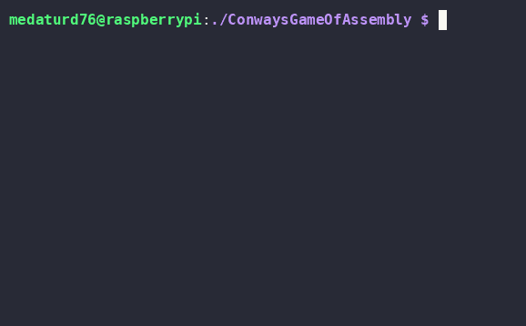

# Medatur76's Game Of Assembly

I was pretty bored during school at the begining of this week and decided to dedicate the 8hrs I try not falling asleep to actually learning a bit more about coding.    
This is the product of that.    
426 lines of arm64 assembly to make a scaleable grid to display Conways Game Of Life:

There is also a version in C that is 100x more readable to understand the logic behind the two big features tactics I employed for fun:

* Using half and full box characters to display two cells in one character space on the console
* Storing each cell as one byte in a massive array rather than storing each as a char, making it 8x more efficient